# **LLM-Agents**

​	随着大语言模型的兴起，AI Agent这一词也随之变得火热，实际上AI Agent已经经历了几个阶段的演变。我们可以先进行一下简短的回顾：

​	$\text{Symbolic Agents:}$在人工智能研究早期阶段，Symbolic AI 占据了主导地位，其特点是依赖于符号性的逻辑。早期的AI Agents主要关注两类问题： 1.transduction problem 2. respresentation/reasoning problem。这些Agents旨在模拟人类思考的方式，并且用于解决问题有明确的推理框架和可解释性。一个经典的例子就是专家系统，但是这类AgentsAgents的缺陷也很明显， 符号主义在处理不确定性和大量现实世界问题时仍有局限性，此外，符号推理赛算法复杂性高，想要平衡其时间效率和性能具有十足挑战性。

  $\text{Reinforcement learning-based agents}$在强化学习（RL）的早期阶段，智能体主要依靠一些基础技术来进行学习，比如策略搜索和价值函数优化。其中，Q-learning和SARSA是比较著名的方法。 但是，随着深度学习技术的快速发展，我们将深度神经网络与强化学习相结合，形成了一种新的学习范式——深度强化学习（DRL）。这种结合让智能体能够从海量的高维数据中学习到复杂的策略，也带来了许多突破性的成果，比如AlphaGo和DQN。深度强化学习的强大之处在于，它让智能体能够在未知的环境中自主地进行学习，而不需要人类的干预或提供明确的指导。这种自主学习的能力，是AI领域的一大飞跃，也是未来智能体能够更好地适应复杂多变环境的关键。

  $\text{LLM-based agents:}$随着大型语言模型（LLM）展现出令人瞩目的涌现能力，研究者们开始用其来打造新一代的人工智能代理。 他们将这些语言模型视为智能体的核心或“大脑”，并通过整合多模态感知和工具使用等策略，大大扩展了智能体的感知和行动能力。基于LLM的代理能够利用“思维链”（Chain of Thought，CoT）和问题分解（task decomposition）等技术，展现出与传统的符号智能体相媲美的推理和规划能力。 此外，它们还能够通过与环境的互动，从反馈中学习并执行新的动作。现如今，基于LLM的智能体已经被用于各种现实世界场景，比如用于软件开发与科学研究。 [[1](https://arxiv.org/abs/2309.07864v3)]

## 智能体系统概述

  在由LLM驱动的智能体系统中，三个关键的不同组件使得LLM能充当智能体的大脑，从而驱动智能体完成不同的目标[[2]](https://lilianweng.github.io/posts/2023-06-23-agent/)。

- **Reasoning & Planning.** 通过推理，智能体可以将任务细分成更简单、可执行程度更高的子任务。就像人类解决问题一样，基于一些证据和逻辑进行推理，因此，对于智能体来说推理能力 对于解决复杂任务至关重要。规划是人类应对复杂挑战时的核心策略。它帮助人类组织思维、确立目标，并制定实现这些目标的途径。对于智能体而言，规划能力同样关键，而这一能力取决于推理， 通过推理，智能体能够将复杂的任务分解为更易管理的子任务，并为每个子任务制定恰当的计划。随着任务的推进，智能体还能通过自省（反思）来调整其计划，确保它们与真实世界的动态环境保持一致，从而实现自适应性和任务的成功执行。 总的来说，推理和规划可以将复杂任务拆分成更易解决的子任务，同时通过反省之前的推理步骤，从错误中学习，并为未来的行动精炼策略，以提高最终结果的质量。

- **Memory.**“记忆”存储智能体过去的观察、想法和行动的序列。正如人脑依赖记忆系统来回顾性地利用先前的经验来制定策略和决策一样，智能体需要特定的内存机制来确保它们熟练地处理一系列连续任务。 当人类面对复杂的问题时，记忆机制有助于人们有效地重新审视和应用先前的策略。此外，记忆机制使人类能够通过借鉴过去的经验来适应陌生的环境。此外，记忆可以分为短期记忆和长期记忆，对于基于LLM的智能体而言，In-context learning的内容可以视作LLM的短期记忆， 而长期记忆则是指给LLM提供一个向量知识库，智能体可以通过检索知识库获取其内部信息。

- **Tool Use.** 当人们感知周围环境时，大脑会整合信息，进行推理和决策。人们通过神经系统控制身体，以适应或创造性行动，如聊天、避开障碍物或生火。 如果智能体拥有类似大脑的结构，具备知识、记忆、推理、规划和概括能力，以及多模式感知能力，那么它也被期望能够以各种方式对周围环境做出反应。而基于LLM的智能体的动作模块负责接收来自大脑模块的动作指令，并执行与环境互动的动作。 LLM收到指令再输出文本是其固有的能力，因此我们后继主要讨论其工具使用能力，也就是所谓的Tool Use。

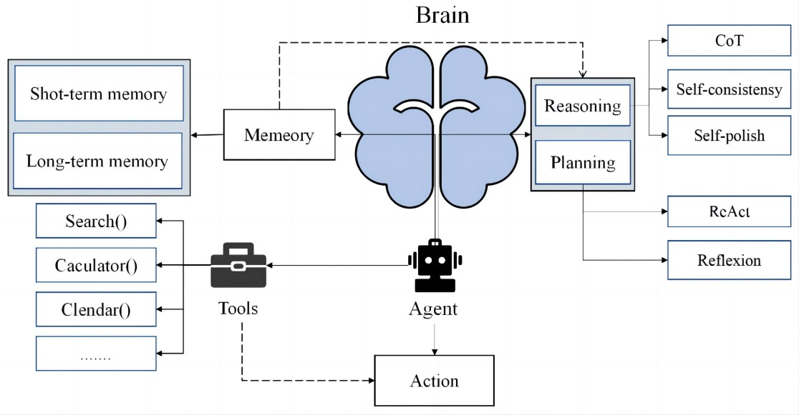

<center>*图 1: 基于LLM的智能体框架。*</center>

# 1.Reasoning & Planning(推理和规划)

## 1.1Reasoning

  Chain of Thought[[3]](https://proceedings.neurips.cc/paper_files/paper/2022/hash/9d5609613524ecf4f15af0f7b31abca4-Abstract-Conference.html).思维链技术逐渐成为大语言模型解决复杂类任务的标准方法，其通过在提示中加入几个具体的推理步骤提升大语言模型解决问题的性能，此外，有很多CoT的变种，如 Zero Shot CoT，其通过在提示中插入"think step by step"这样的一句话引导模型思考，推理出最终答案。

  Tree of Thoughts.[[4]](https://proceedings.neurips.cc/paper_files/paper/2023/hash/271db9922b8d1f4dd7aaef84ed5ac703-Abstract-Conference.html)ToT通过在每个步骤探索多种推理可能性来扩展CoT。它首先将问题分解为多个思考步骤，并在每个步骤中生成多个想法，从而创建一个树状结构。 然后基于树状结构进行搜索寻求最优结果，搜索过程可以是BFS（广度优先搜索）或DFS（深度优先搜索），每个状态由分类器（通过提示）或多数投票评估。

## 1.2Planning

  Least-to-Most[[5]](https://arxiv.org/abs/2205.10625)是提出问题后，先将其分割成若干小问题，然后一一解决这些小问题的一种策略。这种策略受到真实教育场景中用于指导儿童的策略的启发。 与CoT Prompting类似，这个策略首先将需要解决的问题分解成一系列子问题。子问题之间存在逻辑联系和渐进关系。在第二步，逐一解决这些子问题。 与CoT Prompting的最大差异在于，在解决下一个子问题时，会将前面子问题的解决方案作为提示输入。一个具体的字母连接的例子如下：

```markdown
Q: think, machine
A: The last letter of "think" is "k". The last letter of "machine" is "e". 
Concatenating "k" and "e" gives "ke". So "think, machine" output "ke".

Q: think, machine, learning
A: "think, machine" outputs "ke". The last letter of "learning" is "g". 
Concatenating "ke" and "g" gives "keg". So "think, machine, learning" is "keg".

Q: transformer, language
A: The last letter of "transformer" is "r". The last letter of "language" is "e". 
Concatenating "r" and "e" gives "re". So "transformer, language" is "re".

Q: transformer, language, vision
A:
```


<center>*图 2: least to most 输出。*</center>

​	ReAct[[6]](https://arxiv.org/abs/2210.03629)通过将动作空间扩展为特定任务的离散动作和语言空间组合，成功将推理和行动集成在LLM中。前者能够使LLM生成自然语言进行推理，分解任务，后者则可以使LLM能够与环境交互（例如使用搜索API）。 ReAct prompt提示模板包含让LLM思考的明确步骤，从Langchain的源码中，我们可以找到如下：

~~~markdown
The way you use the tools is by specifying a json blob.
Specifically, this json should have a `action` key (with the name of the tool to use) and a `action_input` key (with the input to the tool going here).
The only values that should be in the "action" field are: {tool_names}
The $JSON_BLOB should only contain a SINGLE action, do NOT return a list of multiple actions. Here is an example of a valid $JSON_BLOB:
```
{{{{
"action": $TOOL_NAME,
"action_input": $INPUT
}}}}
```
ALWAYS use the following format:

Question: the input question you must answer
Thought: you should always think about what to do
Action:
```
$JSON_BLOB
```
Observation: the result of the action
... (this Thought/Action/Observation can repeat N times)
Thought: I now know the final answer
Final Answer: the final answer to the original input question
~~~


<center>*图 3: ReAct输出。*</center>

​	Reflecxion[[7]](https://proceedings.neurips.cc/paper_files/paper/2023/hash/1b44b878bb782e6954cd888628510e90-Abstract-Conference.html)是一个为智能体提供动态记忆和自我反思能力从而提升智能体推理能力的框架。如下图所示，Reflexion框架中有三个角色，分别是Actor,Evaluator,Self-Reflection， 其中Actor模型基于观察到的环境和生成文本和动作，动作空间遵循ReAct中的设置，在ReActReAct中，特定任务的动作空间用语言扩展，以实现复杂的推理步骤。然后生成的这些文本和动作轨迹由Evaluator进行评估，比如用0,1来表示好坏，接着Self-Reflection会生成特定的文本反馈，提供更丰富、有效的反思并被存储到记忆中。最后，Actor会根据得到的记忆生成新的文本和动作直到完成任务。

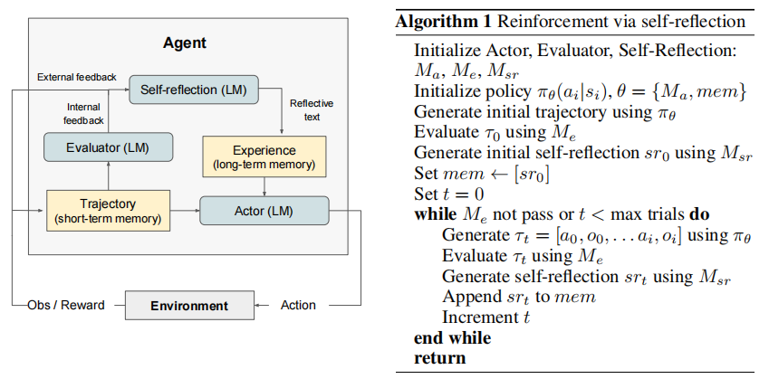

<center>*图 4: Reflexion 框架。*</center>

​	论文中提到，在序列决策任务**ALFWorld**上，为了实现自动化评估采用了两个技术：1.用LLM进行二分类 2.人工写的启发式规则检测错误。对于后者，简单来说就是 如果智能化执行相同操作并收到相同响应超过3个周期，或者当前环境中的操作次数超过30次(计划不高效)，就进行自我反思。

  $\text{Chain of Hindsight(CoH)}$.[[8]](https://arxiv.org/abs/2302.02676)是一种引入了人类偏好的训练方法，该方法不仅使用正面反馈数据，还利用了负面反馈数据，此外在模型预测时引入了反馈条件 ，使模型可以根据反馈学习并生成更符合人类偏好的内容。但$\text{CoT}$利用了序列形式的反馈，在训练时给模型提供更丰富的信息，具体如下：

```markdown
# How to explain a neural network to a 6-year-old kid? Bad:{a subpar answer} Good:{a good answer}.
```

​	这样的数据拼接格式能组合不同种类的反馈，从而提升模型性能。在推理阶段，我们只需要在prompt中给模型指定好Good就能引导模型生成高质量的结果。 此外，在训练时并不是所有的token都纳入损失函数计算，feedback token即Good or Bad只用来提示模型接下来预测时生成质量好的内容还是差的内容，具体损失函数公式如下：
$$
\begin{aligned} \log p(\mathbf{x})=\log \prod_{i=1}^{n} \mathbb{1}_{O(x)}\left(x_{i}\right) p\left(x_{i} \mid\left[x_{j}\right]_{j=0}^{i-1}\right) \end{aligned} \tag{1}
$$
​	其中$\mathbb{1}_{O(x)}$是指示函数，如果$x_i$属于$\text{feedback token(Good or Bad)}$，则取值为$0$，反之为$1$。人类反馈数据，并不止单纯是先前所表述的只有$\text{Good or Bad}$，它可以是更广义的形式，我们可以记作$D_h=\{q,a_i,r_i,z_i\}^{n}_{i=1}$，$q,a_i$分别是问题和答案，$r_i$是答案的评级高低，$z_i$则是人类提供的事后反馈。假设反馈的评级由低到高排的顺序是$r_{n} \geq r_{n-1} \geq \cdots \geq r_{1}$,那么在微调时数据拼接的形式如下：$d_h=(q,z_i,a_i,z_j,a_j,\cdots,z_n,a_n),(i\leq j\leq n)$，训练时模型只会根据给定的前缀预测$a_n$，使得模型能够自我反映以基于反馈序列产生更好的输出。（笔者用小样本``900条数据``在7B级别的LLM上尝试微调时，发现如果反馈评级和回答$z_i,a_i,z_j,a_j,...,z_n,a_n$按照顺序排列，那么模型在推理时没法较好地适配不同反馈前缀，即生成的内容与反馈指定的预期的内容不符。比如$\text{feedback token}$分别是“非提问式共情”和“提问式共情”，数据拼接格式为$\text{“}q,\underbrace{非提问式共情}_{\text{feedback token}}a_1,\underbrace{提问式共情}_{\text{feedback token}}a_2\text{”}$。模型在预测时即便给定了不同的$\text{feedback token}$，其对于提问式共情的感知能力仍然不足，一直会进行非提问式共情。）因此笔者猜测如果采用小批量数据在规模较小的模型上训练会导致位置偏差(Position Bias)，如果能把不同评级的训练数据打乱或许能增强模型的泛化能力，促使模型理解不同$\text{feedback token}$代表的含义而不是仅仅记住其位置特性。

```markdown
# 我最近心情很糟糕 非提问式共情:{听起来你真的很难受呢} 提问式共情:{我真是替你感到难过，请问你现在赶紧怎样呢？想和我聊一聊吗？}.
```

​	在训练中，由于模型在预测时条件化了另一个模型输出及其反馈，因此可能会简单地“复制”已提供的示例，而不是真正理解任务。 为了防止模型只“复制”示例而不学习任务，作者在训练时随机掩盖了$0\%$到$5\%$的历史$\text{token}$。这意味着模型无法直接看到这些$\text{token}$，从而需要真正地理解上文，而不是简单地复制，这种随机掩盖增加了模型的泛化能力。


<center>*图 5: Chain of Hindsight论文实验。*</center>

​	该文对RLHF和$\text{CoH}$方法进行了实验对比，图中的蓝色柱是标准指令上的得分，从整体上看，RLHF在标准指令上最终的效果还是要比$\text{CoH}$要好的，但是当条件词改变，让模型输出更好的质量的内容时，$\text{CoH}$生成的结果质量要比RLHF要好，而且对于不同条件词的变化更为敏感，说明模型较好地理解了人类偏好。改论文实现方法也比较简单，也有所缺陷，比如对一个回答要准备多条（对应不同的偏好），假设需要训练一个十轮对话，每一轮对话的偏好为$K$个，那么需要标注$10\times K$​的回答语料，极大程度上依赖于人力。

​	在推理时，不同于原始对话历史拼接方式，我们需要在末尾额外加上$\text{feedback token}$。假设$\text{feedback token}$分别是$\text{good answer:}$和$\text{bad answer:}$，则具体如下：

```shell
#假设正常的多轮对话数据拼接方式为
user:我今天心情不好。</s>assistant:请问发生什么了宝贝?
#采用CoH以后的多轮对话数据拼接方式会变为
user:我今天心情不好。</s>assistant:<good answer>:请问发生什么了宝贝?<bad answer>:我理解你的感受。
```


<center>*图 6: Chain of Hindsight模式下的token拼接。*</center>

缺点：部署模型推理服务时不能直接使用Tokenizer提供的```apply_chat_template```的方法，需要工程师自定义实现多轮对话的拼接方式。

# 2.Memory(记忆)

​	在神经科学领域，人类的记忆被分为几种不同的类型，这些类型在信息处理和存储方面各有特点，具体如下：

​	1.**感觉记忆（Sensory Memory）**这是记忆系统的第一阶段，非常短暂，它保存了来自感官的信息，如视觉和听觉，通常只持续几秒钟。例如，当你看到一串数字时，你能在短时间内记住它们，这就像计算机中的缓存，用于临时存储。

​	2.**短期记忆（Short-term Memory）**短期记忆是你在短时间内能够主动保持和操纵的信息。它有有限的容量，通常可以持续大约20-30秒，通过重复或其他策略可以转移到长期记忆。这就像计算机的RAM，可以快速读写，但断电后信息会丢失。

​	3.**长期记忆（Long-term Memory）**长期记忆是信息可以存储很长时间的地方，从几个小时到一生。它分为两种主要的子类型：**(a)**显性记忆（Explicit Memory）这是有意识的记忆，可以进一步分为事实和信息（语义记忆）以及个人经历（情景记忆）。就像在硬盘上存储的文件，你可以有意识地检索这些信息。**(b)**隐性记忆（Implicit Memory）这是无意识的记忆，包括技能、习惯和条件反射（骑单车、敲键盘）。这些记忆不像显性记忆那样容易被意识到，但它们影响你的行为和反应。这就像计算机的BIOS或操作系统设置，你通常不直接与它们交互，但它们影响计算机如何运行。我们可以将智能体和记忆按照如下映射进行理解：

- 感觉记忆就像原始输入对应的语义嵌入，包括文本、图像和其他模态。

- 短期记忆就像上下文学习($\text{In-context learning}$)，是有限的，受到$\text{LLM}$上下文窗口限制。

- 长期记忆就像外部向量库，智能体可以通过快速检索从向量库中抽取相关的信息进行阅读理解。

​	随着 AI 的不断演化及其应用领域的扩展，为其赋予长期记忆功能变得愈发重要，长期记忆在多方面提升了 AI 系统的能力：以LLM+RAG范式的问答系统而言，长期记忆能有效地缓解大语言模型的幻觉现象，提升在垂直领域的专业表现力。其次通过存储关键信息结合时序检索可以在当前和过去场景建立联系，或是了解用户过往信息如兴趣爱好等从而增强智能体的适应能力。

​	在AI越来越强大的今天，人们开始有了自己的"AI助手"，甚至开始体验AI虚拟男女友，”AI陪伴“逐渐成为一个有潜力的市场。一个好的AI陪伴产品，应当像一个朋友，做到”懂我“，陪伴不仅仅是对用户表明需求的响应，而是一种深入到个体心理和情感层面的理解，比如了解用户喜好、兴趣和习惯，甚至与用户价值观和信念共鸣[[9]](https://mp.weixin.qq.com/s/zcSMerSKX30P2Hrwhoh0TA)。

​	从技术层面讲，”懂我“的基础是长期记忆，智能助手只有记得之前发生的事情，才能精准把握用户偏好，了解用户成长中的重要时刻，行为习惯。而智能助手的的记忆力一直是各个团队的研究重点，至今并未看到成型的解决方案。为此，笔者搜索并总结了部分关于AI智能体长期记忆相关方面的前沿研究。

## 2.1 MemoryBank

​	**MemoryBank** [[10]](https://ojs.aaai.org/index.php/AAAI/article/view/29946)聚焦于如何为大语言模型（LLMs）设计高效的**长期记忆机制**。该研究旨在解决当前生成式 AI 在长期对话中记忆能力有限的问题。通过设计一套基于外部记忆存储的系统，MemoryBank 可以让LLM回顾历史交互，逐渐增强对上下文的理解并适应和用户过往的交互对话，逐渐增强在长期交互场景下的对话表现。其根据艾宾浩斯遗忘曲线理论设计了一个和人类认知过程相似的动态记忆机制，可以让LLM随着时间流逝记忆、选择性遗忘或强化记忆。**MemoryBank**是一个围绕三个核心支柱构成的统一机制：（1）记忆存储（2）记忆检索（3）记忆更新。

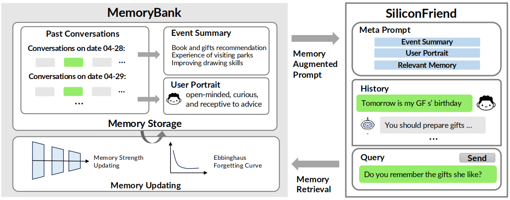

<center>*图 7: MemoryBank框架。*</center>

​	记忆存储是一个包含三种不同层次信息的数据库：（1）附带了时间戳信息的过往对话。（2）基于对话提炼出的每日事件总结。（3）动态用户个性了解，通过长期的互动不断地评估创造日常的关于用户的个性洞察的见解，进一步整合见解以形成较为全面的用户画像，从而促使LLM根据用户信息学习、适应和调整其回复内容，增强用户体验。

​	其记忆检索机制基于$\text{FAISS}$向量数据库，每一轮的对话和事件总结被视作一个记忆块$m$，通过一个预训练的双塔编码器将$m$编码成语义向量$h_m$，最终构成一个记忆集合$M=\{h_m^{0},h_m^{1},h_m^{2},...,h_m^{|M|}\}$。用户对话时其输入$c$会先被编码成向量$h_c$，然后从$M$中检索到最相似的$h_{m}^{j},j=0,...,|M|$作为相关记忆。

​	对于那些期望更具人类化记忆行为的应用场景，则需要进行记忆更新对过往地很少被回溯的记忆片段进行遗忘。如AI陪伴等，可以使AI伴侣显得更加自然。**MemoryBank**的记忆更新机制基于艾宾浩斯遗忘曲线并遵循如下几个原则：

- **遗忘率(Rate of Forgetting) ** 记忆保留能力会随着时间的推移而减少。艾宾浩斯遗忘曲线中量化了这一点，表明在学习后，除非有意识地回顾信息，否则信息会迅速丢失。
- **时间和记忆衰减(Time and Memory Decay)** 艾宾浩斯遗忘曲线在一开始十分陡峭，这表明在学习后的最初几个小时或几天内，大量的学习信息被遗忘了。在这个初始阶段之后，记忆丧失的速度就会减慢。
- **间距效应(Spacing Effect)**  艾宾豪斯发现，重新学习信息比第一次学习信息更容易。定期回顾和重复学习到的知识可以重置遗忘曲线，使其不那么陡峭，从而增强对知识的长久印象。

​	艾宾浩斯遗忘曲线的公式是$\begin{aligned}R=e^{-\frac{t}{S}} \end{aligned}$，其中$S$代表记忆强度，其依赖于如学习深度或者重复次数的关键因子，$t$代表学习知识后经过的时间，当记忆在对话中被回顾以后，将会增加$S$然后将$t$​重新设置为0。

​	论文并为过多详细阐述技术实现细节，整体篇幅不长，易于理解。

## 2.2 Generative Agents

​	斯坦福大学的研究-**Generative Agents: Interactive Simulacra of Human Behavior**[[11]](https://dl.acm.org/doi/abs/10.1145/3586183.3606763)，（即 AI 小镇）是一项极具开创性的尝试，展示了生成式 AI 模型在模拟人类行为和社会互动中的潜力。这篇论文中，研究人员构建了一个虚拟的模拟环境——“AI 小镇”，并赋予其中的虚拟角色（Generative Agents）自主性、记忆力以及持续的行为和社会交互能力。这些角色可以模仿人类的日常活动，包括规划自己的日程、参与对话、形成关系，并在交互中基于长期记忆调整行为。具体地，研究人员设计了一个可以存储、合成和应用相关记忆生通过LLM生成可靠行为的智能体框架，该框架有三个核心：

- **Memory stream（记忆流）** 记忆流是一个长期记忆模块，以自然语言记录智能体的全面经历列表。记忆检索模型结合相关性、时效性和重要性，从中提取所需记录，以支持智能体的实时行为决策
- **Reflection (反思) ** 将记忆综合为更高层次的推论，使智能体能够随着时间推移得出关于自身和他人的结论，从而更好地引导其行为。
- **Planning and ReActing（规划和反应）** 将这些结论及当前环境转化为高层次的行动计划，然后递归地细化为具体的行为与反应。

​	这些不同层次的记忆，即反思和计划会被反馈回记忆流中，对智能体后继的行为与决策产生影响。

### 2.2.1 Memory Retrieval 

​	原文中说到检索由三个要素构成：

​	**Recency (最近性)** 最近被访问的记忆对象分配更高的分数，使得智能体能够更容易关注到刚刚发生或今天早些时候的事件。

​	**Importance（重要性）**则通过为智能体认为重要的记忆对象分配更高分数，来区分日常琐事与核心记忆。例如，一件平凡的事情，比如在自己房间吃早餐，会得到较低的重要性评分，而一件重大事件，比如与伴侣分手，则会得到较高评分。重要性评分有多种可能的实现方式，原文中的实现方式是通过提示工程让大语言模型进行评分，prompt如下：

```markdown
"""On the scale of 1 to 10, where 1 is purely mundane
(e.g., brushing teeth, making bed) and 10 is
extremely poignant (e.g., a break up, college
acceptance), rate the likely poignancy of the
following piece of memory.
Memory: buying groceries at The Willows Market
and Pharmacy
Rating: <fill in>"""
```

​	**Recency（相关性）**为与当前情境相关的记忆对象分配更高的分数。例如，如果查询是某个学生正与同学讨论如何准备化学考试，那么与早餐相关的记忆对象的相关性应较低，而与老师和课业相关的记忆对象的相关性应较高。原文采用了语义相似度作为相关性的衡量，即通过预训练模型编码器将每条记忆文本编码为语义向量，通过计算记忆向量和当前查询向量的语义相似度来确定相关性。

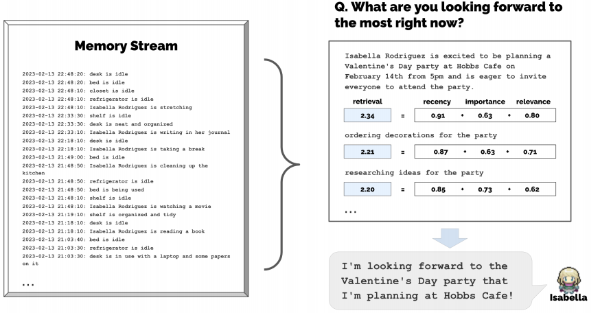

<center>*图 8: GenAI记忆流。*</center>

​	为了计算最终的检索分数将**新近性**、**相关性**和**重要性**的分数使用最小-最大缩放法$(\operatorname{min-max scaling})$归一化到$ [0, 1]$​​ 范围。检索函数将所有记忆的分数计算为三者加权组合的形式：
$$
\begin{aligned}score=\alpha_{recency}⋅recency+\alpha_{importance}⋅importance+\alpha_{relevance}⋅relevance \end{aligned} \tag{2}
$$
​	与MemoryBank不同，Gen AI中并未提及具体的记忆更新机制，即智能体所有发生过的行为都会被记录，不会选择性地遗忘或者强化，随着行为的增加，检索的记忆量也随之上升，如果检索数量没有限制为$\text{Top1}$则之前发生的事情未被遗忘或更新可能导致检索出相关冲突片段影响智能体的决策。比如用户在8月份某一天的白天八点钟提及“我今晚想去看一场电影《变形金刚》。”，晚上七点的时候说“我改变主意了，我想看《功夫熊猫》”。在9月份，如果用户问智能助手“我上月看了什么电影？”，那么检索出来的很可能会遗漏“我改变主意了，我先看《功夫熊猫》”这句相关信息，导致智能助手未能正确判断用户最后看了什么电影。

​	引入时间维度信息检索可以更有效地帮助智能体检索到近期发生的事件，**TempRALM**[[12]](https://arxiv.org/abs/2401.13222)模型虽未直接研究如何更好地实现多智能体的长期记忆机制，但其提出的融入时间戳信息的检索机制值得借鉴。具体地，TempRALM在检索的召回阶段将语义相似度和时间相关性纳入考量：
$$
\begin{aligned} TempRet_t(q,d,q_t,d_t) = s(q,d)+\tau(q_t,d_t)\end{aligned} \tag{3}
$$
​	$TempRet_t(q,d,q_t,d_t)$是赋分函数，而$s(q,d)$就是查询与文档的语义相似度，$\tau(q_t,d_t)$则是融入时间信息的函数，其主要遵循如下原则：(1)如果时间差过大，则得分应该较低。（2）需要和语义相似度数值处于一个量级（不同量级则会导致其中一方不起作用，比如一个是$10^{2}$级别，另一个是$10^{-1}$级别。）。最终的$\tau(q_t,d_t)$形式如下：
$$
\begin{aligned}{\hat \tau(q_t, d_t)}&=\frac{\alpha_{scale}}{q_t-d_t}\\
\tau(q_t, d_t)&=\frac{\hat \tau(q_t, d_t)-\mu_{\tau}}{\sigma_{\tau}} \times \sigma_{s}+\mu_{s}\end{aligned}\tag{4}
$$
​	其中，$\alpha$是缩放因子，$\mu_t$是所有时间分数的均分，$\sigma_\tau$是时间分数的标准差，$\sigma_{s}$是语义相关性的标准差，$\mu_s$是语义相关性的均值。

### 2.2.2 Reflection

​	反思是由智能体生成的更高层次、更抽象的思想。由于反思也是一种记忆，它在检索时会与其他观察记录一同被包含在记忆流。当智能体最近感知到的事件的重要性分数之和超过某一阈值（原文设定为 150）时，就会触发反思生成。在实验中，智能体每天大约会进行两到三次反思。

​	第一步是是确定反思的主题，智能体需要根据最近的经历判断可以提出的问题。从智能体的记忆流中提取最近的 100 条记录，例如：“Klaus Mueller正在阅读关于绅士化的书籍”，“Klaus Mueller正在与图书管理员讨论他的研究项目”，“图书馆的桌子目前无人占用”，然后向语言模型发送以下提示：

```markdown
"""Given only the information above, what are 3 most salient highlevel questions we can answer about the subjects in the statements?"""
#仅根据上述信息，可以回答的三个最重要的高层次问题是什么？
```

​	模型的回答会生成候选问题，例如：“Klaus Mueller热衷于哪些话题？”以及“Klaus Mueller和Maria Lopez之间是什么关系？"，然后使用这些生成的问题作为查询，并为每个问题从记忆流中收集相关记忆（包括其他反思）。随后，通过提示工程让大语言模型提取见解，并引用支持这些见解的具体记录。完整的提示如下：

```markdown
"""Statements about Klaus Mueller
1. Klaus Mueller is writing a research paper
2. Klaus Mueller enjoys reading a book
on gentrification
3. Klaus Mueller is conversing with Ayesha Khan
about exercising [...]
What 5 high-level insights can you infer from
the above statements? (example format: insight
(because of 1, 5, 3))"""
```

​	这一过程生成了诸如以下的反思陈述：$\text{“克劳斯.穆勒致力于研究绅士化（基于1, 2, 8, 15）”。}$​，随后语言模型解析（从回复中抽取有意义的文本内容）并将该陈述作为反思存储在记忆流中，同时包括关于记忆对象的引用（笔者的理解是那些数字序号）。反思机制明确允许智能体不仅反思其观察到的内容，还可以反思其他反思。例如，上述关于克劳斯·穆勒的第二条陈述就是他之前进行的一次反思，而不是环境中的观察。因此，智能体可以生成反思树：树的叶节点代表基础观察记录（智能体的一系列行为），非叶节点则代表随着层级上升逐渐变得更抽象、更高层次的思想（比如反思），如下图所示：


<center>*图 9: GenAI不同层次记忆。*</center>

### 2.2.3 Planning and ReActing 

​	**Planning.**尽管大型语言模型能够根据情境信息生成合理的行为，但为了确保行为序列在更长的时间跨度内保持可靠，智能体需要进行规划。如果仅通过提示语言模型提供克劳斯的背景信息、时间描述，并询问他此刻应该做什么，他可能会在中午12点吃午餐，但又会在12:30和1点再次吃午餐，即使他已经吃过两次了。如果只考虑当前时刻的行为可靠性则会牺牲长时的行为可靠性。为了解决这个问题，规划是必不可少的。克劳斯的下午计划这样将会更合理：他在12点到霍布斯咖啡馆边吃午餐边阅读，1点在学校图书馆进行研究论文的撰写，3点去公园散步放松。

​	规划描述了智能体未来的一系列行动，并帮助智能体在长时间内保持行为一致性。一个规划包括地点、开始时间和持续时间。例如，克劳斯·穆勒致力于他的研究并且马上要面临截止日期，他可能会选择整天在自己的书桌前撰写研究论文。一条规划可能是：“2023年2月12日上午9点起，奥克山学院宿舍克劳斯·穆勒的房间内书桌处，进行180分钟的阅读和研究论文笔记。”和反思一样，规划也会被存储在记忆流中，并在检索过程中与观察和反思一起被考虑。这使得智能体能够综合这些信息做出行为决策，并在必要时实时调整计划。

​	对于智能体来说，不能只大致考虑要做什么，而要考虑到更合理与细致的行为信息，比如一个画家智能体不可能计划在要点柜台前一直坐四个小时不动。更理想的情况是：在四小时的工作室时间里，智能体规划好时间进行材料收集、调制颜色、休息和清理。通过自顶向下的方式，递归生成智能体更细致的行动，一个prompt示例如下：

```markdown
"""Name: Eddy Lin (age: 19)
Innate traits: friendly, outgoing, hospitable
Eddy Lin is a student at Oak Hill College studying
music theory and composition. He loves to explore
different musical styles and is always looking for
ways to expand his knowledge. Eddy Lin is working
on a composition project for his college class. He
is taking classes to learn more about music theory.
Eddy Lin is excited about the new composition he
is working on but he wants to dedicate more hours
in the day to work on it in the coming days
On Tuesday February 12, Eddy 1) woke up and
completed the morning routine at 7:00 am, [. . . ]
6) got ready to sleep around 10 pm.
Today is Wednesday February 13. Here is Eddy’s
plan today in broad strokes: 1)"""
```

​	这将会生成一个粗略计划，通常为5到8个部分。例如：“1）早上8点起床并完成早间例行；2）10点前往奥克山学院上课；[...]；5）下午1点到5点进行新作曲项目；6）下午5:30吃晚餐；7）晚上11点前完成作业并入睡。”。智能体将此计划存储在记忆流中，并递归地将其细化为更具体的行动。首先，将其分解为每小时的行动块，例如：“下午1点至5点进行新作曲项目”被细化为：“下午1点开始头脑风暴，为作曲项目提出一些新想法；[...]；下午4点短暂休息以恢复创意活力，然后审阅并润色作曲。”。然后再次递归分解为5到15分钟的时间块，例如：“下午4点：吃点水果、燕麦棒或坚果等轻便零食；下午4:05：在工作空间附近散步；[...]；下午4:50：花几分钟清理工作空间。”，这个过程可以根据想要的细粒度进行调整。

​	**ReActing.** 智能体在一个行动循环中运行。在每个时间步，智能体会感知周围的世界，这些感知到的观察会被存储到它的记忆流中。我们通过提示语言模型基于这些观察来决定智能体是**继续执行其现有计划，还是做出反应**。例如，当智能体站在画架前作画时，可能会触发对画架的观察，但这通常不会触发反应。然而，如果埃迪的父亲约翰记录到他看到埃迪正在花园散步，结果就会不同。以下是提示的内容，其中 [Agent's Summary Description] 是一个动态生成的概述智能体目标和性格特征的段落：

```markdown
[Agent’s Summary Description]
It is February 13, 2023, 4:56 pm.
John Lin’s status: John is back home early from
work.
Observation: John saw Eddy taking a short walk
around his workplace.
Summary of relevant context from John’s memory:
Eddy Lin is John’s Lin’s son. Eddy Lin has been
working on a music composition for his class. Eddy
Lin likes to walk around the garden when he is
thinking about or listening to music.
Should John react to the observation, and if so,
what would be an appropriate reaction?
```

​	上下文总结是通过两个查询提示生成的：**“What is [observer]’s relationship with the [observed entity]?”**、**“[Observed entity] is [action status]”**，模型的输出建议约翰可以考虑询问埃迪关于他的作曲项目的情况。随后，我们会从发生反应的时间点开始重新生成智能体的现有计划。最后，如果该行动表明智能体之间会发生互动，就生成他们的对话内容。

​	对话时，通过将智能体的记忆与对方的相关记忆作为条件，生成他们的对话内容。例如，当约翰与埃迪开始对话时，会先根据约翰关于埃迪的总结性记忆，以及他决定询问埃迪作曲项目时的预期反应，生成约翰的第一句话：

```markdown
[Agent’s Summary Description]
It is February 13, 2023, 4:56 pm.
John Lin’s status: John is back home early from
work.
Observation: John saw Eddy taking a short walk
around his workplace.
Summary of relevant context from John’s memory:
Eddy Lin is John’s Lin’s son. Eddy Lin has been
working on a music composition for his class. Eddy
Lin likes to walk around the garden when he is
thinking about or listening to music.
John is asking Eddy about his music composition
project. What would he say to Eddy?
```

​	对话结果是:“Hey Eddy, how’s the music composition project for your class coming along?”，从埃迪的视角来看，约翰开始这段对话被视为一个他可能想要做出反应的事件。因此，与约翰类似，埃迪会检索并总结他关于与约翰关系的记忆，以及可能与约翰刚刚的对话内容相关的记忆。如果他决定回应，我们会基于埃迪的记忆总结和当前的对话历史生成他的回答：

```markdown
[Agent’s Summary Description]
It is February 13, 2023, 4:56 pm.
Eddy Lin’s status: Eddy is taking a short walk
around his workplace.
Observation: John is initiating a conversation
with Eddy.
Summary of relevant context from Eddy’s memory:
John Lin is Eddy Lin’s father. John Lin is caring
and is interested to learn more about Eddy Lin’s
school work. John Lin knows that Eddy Lin is
working on a music composition.
Here is the dialogue history:
John: Hey Eddy, how’s the music composition project
for your class coming along?
How would Eddy respond to John?
```

​	然后得到Eddy的回应:“Hey Dad, it’s going well. I’ve been taking walks around the garden to clear my head and get some inspiration.”，接下来的对话将通过相同的机制生成，直到其中一个智能体决定结束对话为止。

​	**Memory stream,Reflection,Planning and ReActing** 三种层次的记忆联合让智能体根据过往的经历学会合理地思考，规划接下来细致的活动以及根据当前环境选择是继续规划还是做出反应，让智能体的思考与行为更像人类。文中还分析了智能体之间的信息传播现象，即测量了两条特定信息在两天内的传播情况，并观察到了智能体社区在模拟期间建立了新的关系，社交网络密度大幅增长，受篇幅和重点限制，笔者就不详细阐述了。

## 2.3 模拟人类记忆过程

​	人类记忆系统为设计 AI 长期记忆提供了宝贵的启示。近年来的研究表明，部分 AI 系统在不同程度上模仿并融入了与人类长期记忆结构相似的机制，认知架构研究也采用了人类长期记忆的关键组成部分：情景记忆、语义记忆和程序性记忆[[13]](https://arxiv.org/abs/2411.00489)。Chessa[[14]](https://pubsonline.informs.org/doi/abs/10.1287/mksc.1060.0212)等人基于Zielske提出的回忆概率函数，提出了一种模型，该模型假设记忆巩固速率$r(t)$表示人类记忆在某时间点被回忆的概率$p(t)$，公式如下：
$$
p(t)=1-\sum_{n=1}^{b-1} \frac{(r(t))^{n}}{n!} \exp (-r(t)) \tag{5}
$$
​	这个模型基于这样一个假设，即每个神经元是独立且随机地发放信号的，它源自于使用时间变化强度函数𝑟(𝑡)的[非齐次泊松过程]()的性质。该模型还考虑了回忆所需的刺激阈值𝑏。指数函数𝑟(𝑡)代表了人类海马体中记忆强度的调整过程：
$$
r(t)=\mu e^{-\alpha t} \tag{6}
$$
​	其中，$\mu$是记忆强度，$\alpha$是衰减率，$t$代表经过的时间，在用向量数据库召回时，只考虑一个事件，因此将$b$设置为1，则召回概率$p(t)$表达式如下：
$$
p(t)=1-\exp(-\mu e^{-\alpha t}) \tag{7}
$$
​	回顾概率随着时间$t$呈指数衰减，然而多次被回忆的记忆和未被回忆的记忆在巩固程度上有差异，因此遗忘速率应作相应调整来反应这一影响。在前一小节所提到的AI小镇实现了三种层次的记忆，记忆检索机制考虑到了记忆的时效性(recency)，重要程度(importance)和相关性(relevance)。**Hou**[[15]](https://dl.acm.org/doi/abs/10.1145/3613905.3650839)等人认为考虑时间流逝、相关性和回忆频率来计算记忆巩固程度能让智能体能够唤起最合适的回忆，促进有效对话。前者侧重于独立为每一个记忆进行评分，通过综合得分选择最适合当前情境下的行动，后者则通过随着时间的推移调整记忆巩固程度，确保记忆的一致性。[Hou]()等人将事件相关性$r$和经过的时间$t$作为变量，带入公式(7)则得到如下的记忆回顾概率公式：

$$
p(t)=1-\exp(-r e^{-\alpha t}) \tag{8}
$$
​	事件相关性可以通过语义向量的余弦相似度衡量，而衰减常数$\alpha$则需要根据事件被回忆的次数进行调整，考虑到$n$次被回忆的事件对应的$\alpha$公式如下：
$$
\begin{aligned}a&=\frac{1}{g_n},\text{ }g_0=1 \\
g_n&=g_{n-1}+S(t),\text{ } S(t)=\frac{1-e^{-t}}{1+e^{-t}}\end{aligned} \tag{9}
$$
​	修改后的 $\operatorname {sigmoid} $函数 $S(t)$ 表示记忆在每次回忆后的巩固过程，并在$t>0$时单调增加。然而，每次回忆导致的$\alpha$的减少是有上限的，以反映长期记忆的巩固。随着回忆次数$n$的增加，$\alpha$的减少速率逐渐降低，这模拟了人类自然记忆的过程，即频繁的回忆会加强记忆的巩固，最终的公式如下：
$$
\begin{aligned}
p_{n}(t) & =\frac{1-\exp \left(-r e^{-t / g_{n}}\right)}{1-e^{-1}} \\
g_{n} & =g_{n-1}+\frac{1-e^{-t}}{1+e^{-t}}
\end{aligned} \tag{10}
$$
​	最终通过设定一个召回阈值$k$确定当前的记忆是否要回忆。公式(8)的函数绘制如下（另$r$=1,$\alpha$和$t$是变量）：

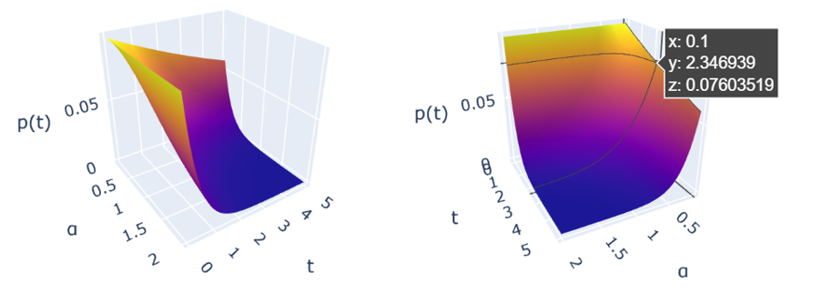

<center>*图 10: p(t)函数绘制图像。*</center>

​	图中可以看到，假设固定住时间$t$，则随着$a$的增大，回顾的概率$p(t)$会减少，反之则增大，而$a$是一个与事件回忆频率变化的数，事件回忆次数越高，则$a$越小，同时也能表明这件事情比较重要，而被回顾的概率也就越高。论文中的实验部分展示该模型和Gen AI(斯坦福的AI小镇)的一些差异之处：


<center>*图 11: 实验案例。*</center>

​	当用户说：”我下周四要和我朋友去音乐会“。本文的模型(model1)生成的内容明显依赖于用户的历史行为（例如，事件 A：周四在大学工作的记录)，而未能适应用户提供的新情境（因为模型回复时提及过往的情境)。这表明该模型在面对用户行为的偏离时存在局限性，它更倾向于优先考虑长期模式和事件的重要性，而非当前的情境。

​	相比之下，Generative Agents (model2)模型使用了一个更简单的评分系统，该系统基于事件的**最近性**、**重要性**和**相关性**，因此选择了事件**D**（周四在餐馆工作）作为最可能的活动。这一选择源于模型对近期活动和事件相关性的重视，可以从事件**D**关联的较高相关性评分以及更短的时间间隔看出。

​	两种模型生成的不同内容突显了不同设计理念的差异：[Hou]()提出的模型注重长期记忆的整合，而 Generative Agents 模型更注重近期和相关性较高的事件。即Hou的方法的主要局限性在于依赖于用户长期的行为模式来计算记忆巩固的概率$p(t)$​​。如果用户行为忽然变化（如开始新工作或学校，生活方式改变），方法的适应性可能有限。虽然该方法考虑了时间因素、回忆频率、相关性因素，但还可以考虑引入其他的因素进一步优化，比如心理场景下考虑记忆的情感重要程度等，可能会进一步提升记忆巩固的效果。

​	**Hippo RAG**[[16]](https://arxiv.org/abs/2405.14831) 借鉴**海马体记忆索引理论(hippocampal memory indexing theory)**模拟人类大脑中海马体的功能，提供动态、渐进式的知识更新机制。海马体索引理论是一个成熟的理论，为人类长期记忆中涉及的组成部分和回路提供了功能性的描述。在该理论中Teyler和Discenna提出人类长期记忆由新皮质(Neocortex)、海马旁回区域(Parahippocampal Regions)、海马体(Hippocampus)三个组件组成，它们协同工作以完成**模式分离(Pattern separation)**和**模式补全(Pattern completion)**的功能。

​	该理论中，模式分离主要在记忆编码过程中完成。记忆编码首先由新皮质接收和处理感知刺激，将其转化为更易操作的（可能是更高层次的）特征，这些特征随后通过**海马旁回区域（PHR）**传递到海马体进行索引。当信号到达海马体时，显著的信号会被包含在海马索引中，并彼此关联。在记忆编码过程完成后，模式补全驱动记忆检索过程。当海马体通过 PHR 管道接收到部分感知信号时，海马体利用其**情境依赖的记忆系统**在海马索引中识别完整且相关的记忆，并通过 PHR 将其路由回新皮质进行模拟。因此，这一复杂过程仅改变海马索引来整合新信息，而无需更新新皮质的表征。	

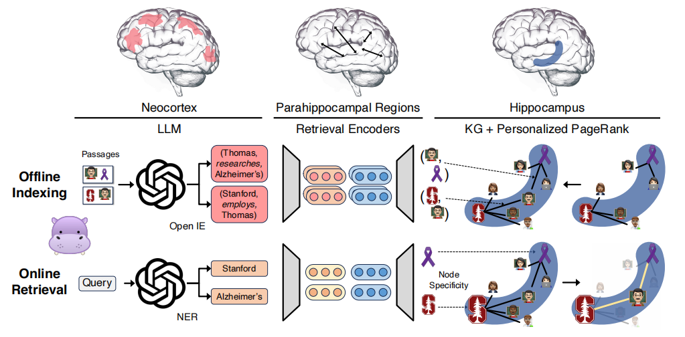

<center>*图 12: HippoRAG结构示意。*</center>	

​	该检索方法由两阶段构成，在**Offline Indexing**阶段，用微调后的LLM从语料库中抽取知识图谱三元组，将语料库中的重要信息以名词短语的形式提取，从而实现更细粒度的模式分离。提取出的三元组构成一个开放式的无约束的知识图谱，作为人工海马体索引。并通过检索编码器提供相似三元组检索功能，为下游的模式补全提供重要信息。通过提示工程的方式，我们可以从给定的文本中抽取出三元组，即开始实体、实体间的关系、结尾实体。然后依据这些抽取的实体构建成一个图，具体地，假设有$N$篇文章，为每一篇文章抽取知识三元组，对所有文章抽取完后共计得到$M$个实体，那么我们可以得到一个$M\times N$的计数矩阵$A$，计数矩阵中的元素$a_{ij}$代表实体$e_i$在文章$P_j$出现的频次，而这个计数矩阵其实也就对应了一个图，我们可以将图写入到图数据库如$Neo4j$中，值得注意的是，在检索阶段我们需要从图中检索出和查询中的实体$c_i$相似的实体节点$e_j$，因此需要依赖到向量检索的功能，当实体数量非常庞大时，我们需要快速检索的功能帮我们从海量实体中快速的检索到相似的实体，而这一点$Neo4j$的$GDS$插件有提供向量检索功能，详情可阅读[此处](https://neo4j.com/labs/genai-ecosystem/vector-search/)。

​	**Online Retrieval**阶段则模拟人类记忆检索过程，人工新皮质从$Query$​​中提取出命名实体，称作(Query Enamed Entities)，并利用检索编码器与知识图谱中的节点关联。这些被选中的节点称为查询节点，作为部分线索输入到人工海马体中，通过模式补全激活相关图谱邻域。此过程使用个性化PageRank（Personalized PageRank）算法，限制搜索范围在特定查询节点上，类似海马体从部分线索提取关联信号。最终，通过聚合PPR输出的节点概率，对之前索引的段落进行排序。

​	具体地，快速向量检索将会检索出与查询实体$c_i$语义相似的实体节点$e_j(j=1,...,k)$，这些语义相似度的实体节点就相当于人脑在回忆时的一些线索，接下来人脑要进一步根据这些线索回忆起更完整的情景，换而言之，我们需要根据这些作为线索的实体节点，计算出完整的文本与这些线索的相似度并进行排序，这一功能则是通过个性化的PageRank算法实现。其背后的直觉如下：PageRank是一个衡量网页重要程度的算法，其核心思想是如果一个网页有很多指入的链接，说明这个网页在其他网页广为引用，表明该网页有较高的重要程度，反之如果一个网页指出的链接比较多则不能说明这个网页比较重要，同理，如果我们将这些实体节点视作一个个网页，指入当前节点的箭头数量多则说明当前节点的重要性高，则可以根据PageRank算法计算一个节点向量$V_e=(e_i,e_2,...,e_M)^T$。

​	让我们回顾PageRank算法的具体细节，将互联网的网页视作节点，从该网页跳转到其他网页的链接视作有向边，用户继续浏览网页时会等概率地（随机）点击当前网页中指出的链接从而跳转到另一个页面，而随着用户点击次数地增加，这一整个长期地随机跳转就会构成一个稳定的模式，即马尔可夫平稳过程，每个网页的PageRank值就对应平稳分布中的某个概率。给定一个有向图:


<center>*图 13: PageRank示意图。(自绘)*</center>	

​	网页$A$有三条入边，网页$B$跳转到$A$和$C$，网页$C$跳转到$A$和$D$，网页$D$会跳转到$A,B,C$。可以将出边视作均匀地传递能量，则$A$可以获得$1/2B$和$1/2 C$，$B$可以获得全部的$D$，$C$可以获得$1/2B$和$1/3D$，$D$可以获得$1/2C$。PageRank是一个不断迭代的算法，上述的过程可以通过图13的右边的矩阵递推公式描述，而这个转移矩阵其实就对应了一个马氏链，随着时间$t$增加，最终的PageRank向量会趋于稳定，即得到马氏链的平稳分布：$\pi=A\pi$。PageRank算法具体流程在此就不多赘述了，具体细节读者可以阅读此处[参考](https://en.wikipedia.org/wiki/PageRank#Simplified_algorithm)。

​	值得注意的是，并不是所有的马氏链都有平稳分布，马氏链存在平稳分布的充要条件为**非周期**与**不可约**，**非周期**的意思是任意状态出发经过有限步回到自身的最大公约数为1，即从状态$s_i$出发回到自身的步数不呈现周期性规律，如$2,4,6,8,....$就是周期性的，因为最大公约数是$2$。**不可约**(irreducible)一词源自于线性代数，即不可再分割的，无法化简的，因此其意思是马氏链中的任意两个状态经过有限步状态转移都能从一个状态转移到另一个状态，是彼此可达的。

​	而在HippoRAG中，将实体视作网页通过PageRank算法求解实体的PageRank向量的原理不变，将与Query有关联的实体检索得到若干个候选实体$\set{R_j}_{j=0}^{k}$，这些检索到的实体有对应的出边和入边，即其他实体和这些实体有关联。根据候选实体，我们可以利用个性化PageRank算法计算得到最终的PageRank向量$V_e=(e_i,e_2,...,e_M)^T$，而有了向量我们就可以利用向量空间模型计算实体向量与所有文档的相似程度，具体思想如下图：

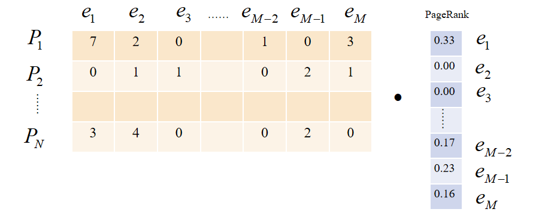

<center>*图 14 HippoRAG中文章相似度计算。（自绘）*</center>	

​	文档和实体共现矩阵$C$的每一行代表文档$P_j$的文档向量，$C_{ji}$代表实体$e_i$在文档$P_j$中出现的频次，相似的文档则实体出现的频次或者实体交集数量较大，实体$e_i$​​​在该文档中出现频次较高则说明该实体比较重要。而PageRank算法计算的实体向量能衡量实体的重要程度，因此计算文档向量与实体向量的点积相似度可以很大程度代表二者的相关程度。而向量空间模型有其固有缺陷：如（1）语义信息缺失，无法考虑词的上下文顺序，无法理解多义词和同义词。（2）稀疏性，计算效率低，词语数量较大时向量维度高且稀疏，导致实际上语义相似的向量通过余弦或内积相似度计算时得到0的结果，即计算的相似度分布容易呈现出偏态和峰态。

​	整体而言HippoRAG的特点如下：通过抽取文档的三元组知识构建知识图谱，存储文档中的关键信息构建索引。在检索时抽取查询中的实体$\set{c_i}_{i=1}^{n}$，根据向量检索快速检索到图中与当前查询实体相关的候选实体节点$\set{R_j}_{j=1}^{k}$，再通过个性化PageRank算法对整个图计算PageRank向量$V_e\in\mathbb R^{M \times 1}$，为了体现出节点的特性，一个自然的想法是对这些候选实体节点赋予一些更高的权重，而不是让所有节点都具有同等的重要性，因此可以在初始化概率分布时给候选节点增加一些重要程度$s_i$，文中定义$s_i=\frac{1}{|P_i|}$，即如果出现这个节点的文章数比较多则说明这个节点的重要程度较低，这和$TF\text{-}IDF$​的思想一样。最后依据PageRank向量与向量空间模型中的文档向量进行相似度计算并排序，从而找到与当前查询最相关的文档。

> [!NOTE]
>
> 在标准的PageRank算法中，增加初始分布某几个维度如$i,j,k$的概率并不能保证得到的平稳分布中的$i,j,k$维度的PageRank值一定是较大的，因为马氏链的平稳分布只与状态转移矩阵有关，不受初始化分布的影响，初始值只会影响收敛速度。而PageRank算法的变种如Personalized PageRank，初始分布可以影响最终的平稳分布。

## 2.4 LLMs+Perona-Plug

​	**Liu**[[17]]()等人认为通过检索式长期记忆的方式实现个性化智能能助手可能会无法完全利用上用户完整的对话信息，并且不能理解用户说话的风格导致影响对话效果。因此提出了一个轻量级的插件式的用户嵌入模块，通过构造每个用户的特定嵌入建模用户所有的对话历史上下文，在不微调大语言模型的参数下让大语言模型能更好地理解并捕捉用户偏好与习惯。

​	该方法采用了一个插件式的用户嵌入模块，每个用户都有一个由共享用户嵌入器计算出的独特个性化嵌入。它将用户$u$的每一条历史行为$h_i^u$编码成一个密集向量$\mathbf h_i^u$，并将这些嵌入向量根据当前输入$x_u$聚合为一个单一的个性化嵌入$\mathbf P_u$。$\mathbf P_u$会与大语言模型的嵌入层融再进行前向推理让LLM生成个性化响应。具体地，论文采用了一个轻量级的用户行为编码器进行用户行为编码：
$$
\mathbf h_i^u=\operatorname {{Enc}^{his}}(h_i^u) \tag{11}
$$
​	用另一个编码器对用户当前输入$x_u$进行编码：
$$
\mathbf x^u=\operatorname {Enc^{input}}(x^u) \tag{12}
$$
​	为了更好让大语言模型获得当前输入与用户行为历史间的表征信息，最直观的思想是通过注意力机制的方式让$\mathbf x_u$与所有的$\mathbf h_i$进行加权平均：
$$
\begin{aligned}
w_{i} & =\frac{\exp \left(\mathbf{x}^{u \top} \mathbf{h}_{i}^{u}\right)}{\sum_{k} \exp \left(\mathbf{x}^{u \top} \mathbf{h}_{k}^{u}\right)} \\
\mathbf{P}^{u} & =\sum_{i} w_{i} \cdot \operatorname{Proj}\left(\mathbf{h}_{i}^{u}\right),
\end{aligned} \tag{13}
$$
​	随后将$\mathbf P_i$与大语言模型嵌入层融合用于引导大语言模型生成个性化回复，给定当前输入$x_u$和之前生成的内容$y_{<i}^u$，对应的损失函数定义如下：
$$
\begin{aligned}\mathbf X_i^u&=[\mathbf I;\mathbf P^u;\operatorname {Emb_{LLM}}(x^u);\operatorname{Emb_{LLM}}({y_{<i}^u})] \\ 
\mathcal L&= -\sum_u\sum_i \operatorname {log}p_{\text{LLM}}(y_i^u|\mathbf X_i^u) \end{aligned}\tag{14}
$$
​	其中，$\operatorname{Emb_{LLM}(.)}$代表大语言模型的嵌入层，$\mathbf I$是一个额外的可训练的指令嵌入层，用于捕获指令信息。在微调时只有三个部分的参数是可以改变的：$\mathbf I$，输入编码器$\operatorname {Enc^{input}}(.)$和投影层$\operatorname {Proj}(.)$(两层MLP)。模型整体结构如下：


<center>*图 15: 模型结构。*</center>	

​	该方法本质上还是微调，需要个性化的对话数据对三个模块参数进行调整，虽然其设计的注意力机制可以动态选择和当前输入最相关的历史行为，但本质上可以视作一个非常朴素的检索机制，只为与**当前输入**相关的历史行为信息分配较高的注意力权重，受编码器参数量影响，这一部分的用户历史行为信息融合得到的语义表征可能效果不那么好。此外，从工程落地的角度考虑，受算力限制，这套方案不太好实施，如对每一个用户而言，为其分配一个行为编码器和输入编码器是不现实的，且由于LLM的结构变动，无法直接套用主流的大语言模型加速推理框架，工程师需要做出较大改动。从可解释角度出发，也不像基于检索机制实现的个性化LLM易于理解，此外，仍然有一个对话窗口的问题需要解决，实际应用时模型不可能利用所有的历史对话信息作为前缀拼接，**因此该方法依然要考虑到与检索机制结合**。

## 2.5 如何测评AI助手的长期记忆能力？

### 2.5.1 Benchmark

​	虽然已有大量研究聚焦于如何更好地检索出相关片段提升大语言模型或智能助手在下游任务的表现，但对于如何评估AI助手在多轮交互对话的长期记忆能力的工作较少。[**LONGMEMEVAL[18]**](https://arxiv.org/abs/2410.10813)是一个能够全面评估智能助手长期记忆能力的基准，其涵盖了500个人工构建的高质量问题，用于测试五个关于长期记忆方面的核心能力：**信息抽取**、**跨会话推理**、**时间推理**、**知识更新**和**知识摈弃**。而为了全面评估智能助手的长期记忆能力，该论文构建了七种不同类型的题目，分别如下：

```markdwon
单会话-用户: 测试回忆单个会话中用户提到信息的能力。
单会话-助手: 测试回忆单个会话中助手提到信息的能力。
单会话-偏好: 测试是否可以利用用户信息生成个性化回复的能力。
跨会话: 测试跨多个会话综合信息的能力。
知识更新: 测试识别用户个人信息变化并更新知识的能力。
时间推理: 测试对用户信息时态方面的意识，包括显式时间提及和时间戳元数据。
拒绝回答: 测试对涉及未知信息的问题不回答的能力
```

​	同时，**LONGMEMEVAL**提供了一个构造连贯、可拓展且附带时间戳信息的对话方法，基准具体的构建流程如下图所示[源自[18]]()：

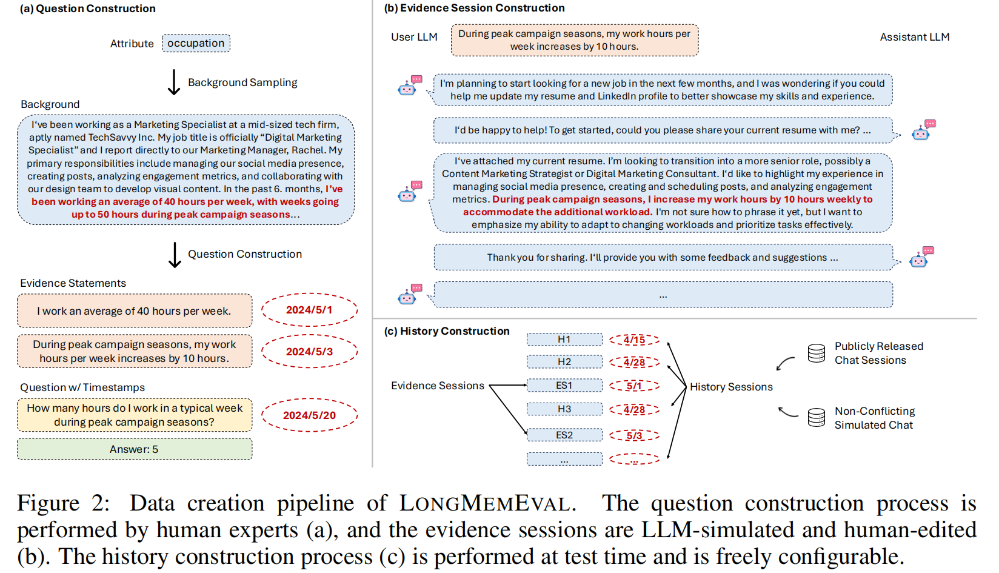

<center>*图 15: LongMemEval数据生成流程。*</center>	

​	论文首先定义了一个包含**164**个用户属性的本体，分为五大类：生活方式、个人物品、人生事件、情境背景与人口信息。然后利用大语言模型针对每一个属性生成以该属性为中心的用户背景段落，这些段落描述了用户的生活经历。从中随机抽取段落并再通过提示工程技术引导LLM生成若干个候选问题，并通过人工改写的方式确保这些问题的难度与多样性。

​	接着，基于背景信息，人工将答案分解为一个或者多个证据语句($evidence\text{ }statements$)，并为其合理地分配时间戳。接着，通过[Self-Chatting]()的方式构建任务导向的证据会话($evidence\text{ }session$)，再将之前的证据语句插入到证据会话中。为确保数据的质量，以上步骤都经过人工干预确保准确性以及表述更加自然、口语化。

​	在对话历史构建阶段，从多个不相关的用户与AI的聊天中抽样，再将上一步构建的证据会话($ES_i$)插入到聊天($H_j$​​)中，并为user-AI chat sesion分配合理的时间戳。不相关对话的来源主要有两部分：（1）利用从用户背景中提取出的属性不冲突的事实通过Self-Chatting的方式进行生成。（2）公开发布的聊天数据，如ShareGPT、UltraChat等。通过这种方式可以最大程度的防止会话上下文的冲突性。

### 2.5.1 长期记忆系统设计

​	论文将长期记忆视作一个大容量的键值对存储数据库$[(k_1,v_1),(k_2,v_2),...]$，其中$k_i$可以是异构的，$v_i$可以重复，并为记忆增强的智能助手制定了三个阶段：（1）$indexing$ 将每一个历史对话$(t_i,S_i)$转化成一个或多个键值对，（2）$retrieval$ 构建一个检索的查询并收集$k$个与查询最相关的键值对，（3）$reading$，LLM通过阅读检索到的结果生成答案。具体如下图所示[源自[18]]()。


<center>*图 16: 检索系统设计。*</center>	

​	**$value$** 表示长期记忆中每一个对话的格式和细粒度，user-AI 聊天会话通常比较冗长并涵盖多个主题，如果将一个聊天会话视作一个value则很可能会降低检索效率并不利于阅读。相反，如果将一个会话压缩成一个总结或者用户特定的事实则会导致信息损失，导致AI助手忽略一些细节，论文中比较了三种不同策略的$value$：**储存整个会话**、**将整个会话按照轮数分解**、**采用总结或事实抽取**。

​	$key$ 会话信息被压缩或者分解后可能仍然会涵盖大量信息，但可能导致与用户查询的关联度降低，因此通常的做法还是用$value$本身做为$key$用于计算和$query$的相似度。论文引入了一个$key\text{ }expansion$方法，即使用总结、关键短语、用户事实与时间戳用于增强索引，这种方式可以强调关键信息并能够通过多种途径有效检索。

​	$query$ 对于普通类型的查询而言，上述提及的$key\text{-}value$优化方式可能解决大部分检索问题，然而当查询涉及到时序信息时，简单的语义相似度或文本匹配度则可能不起效，因此论文设计了一个$time\text{-}aware\text{ }indexing$与$query\text{ }expansion$策略，$value$用有时间戳的事件进行索引，然后在相关时间范围内进行检索。

​	$reading$ 回答一个复杂的问题可能需要召回大量的记忆，虽然检索的准确度可以更具上述的设计进行优化，但是不能保证LLM能够从召回结果中有效地推理出正确答案，论文们探索了不同的阅读策略，并通过实验结果表明如在回答前提取关键信息([Chain of Note]())和使用结构化格式提示([structured format prompting]())能有效提高阅读能力。


<center>*图 17: 问答效果对比实验。*</center>	

​	图六[源自[18]]()实验结果表明，在不同设计的$value$中，将Round作为$value$能够提升问答效果。如果将Session Summary当作$value$，那么效果比较差，原因可能是因为总结压缩了过多的信息，丢失了很多细节，而将Round Facts当做$value$的效果也相当不错，token数量为Round的一半左右在多会话子集上的效果超过了Round，原因可能是Round Facts是篇幅较短关键的信息，本身就能够代表当前Round的绝大部分含义。这里有一个细节，即图中显示Round的token数量的范围较大，而Session的token数量范围较为集中，按理来说Session是由每一个Round构成的，二者的token数量应该相同，因此这里的Session应只是$evidence\text{ }session$，而不是指整个历史聊天记录作为的session（```笔者已通过源码验证，读者可再自行确认```）。论文对不同的$key$的构造也进行了消融实验，具体如下图：

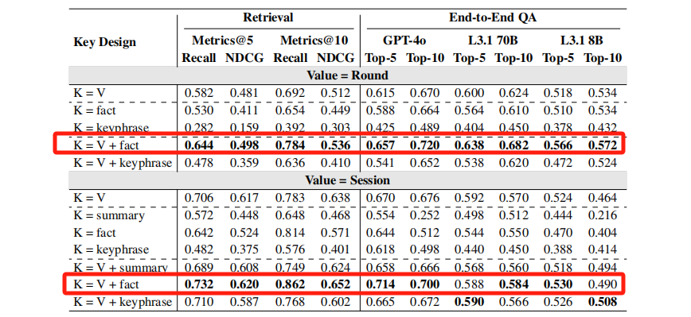

<center>*图 18: 不同key value模式组合实验结果。*</center>

​	实验结果表明，在采用Round作为$value$的前提下$key=value+fact$的检索效果比$value+其他$的效果明显要高。在$value$是Session的前提下，$key=value+fact$的结果在大部分情况下比$value+其他$的下好。虽然fact，summary与keyprhase能够代表$value$绝大部分的含义，信息更加聚焦，但是单独使用这些关键信息或者压缩信息作为$key$用于索引的效果并不理想。为了帮助读者更清晰地了解其检索的运作机制以及存在的一些问题，笔者如下阐明其index expansion的过程，以round+userfact为例子。首先明确检索的文档为论文中所说的构建的history，history由三部分session构成：shareGPT,ultraGPT与evidence session，每一个history大约有200轮对话。笔者下载了论文项目提供的数据文件$\text{longmemeval\_s.json}$，数据列表中的每一个元素都是历史对话字典，字典中有一个键叫做haystack_session_ids，对应的值是一个存放不同session_id的列表，表明当前会历史会话由不同的session构成。笔者主要介绍抽取user fact的部分以及检索流程。

​	抽取每一轮的user fact可以通过zero shot prompting或者few shot prompting的方式让大语言模型完成，具体步骤是将当前的evidence session作为prompt的变量传入，大语言模型再根据传入的对话列表抽取出一些相关的facts放在列表中，如果没有则列表为空。示意图如下：

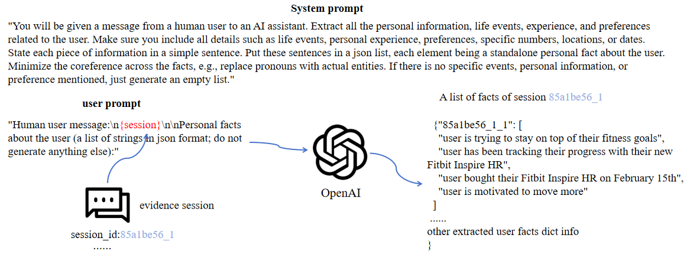

<center>*图 19: user facts抽取示意。（自绘）*</center>	

​	这些被抽取的usef fact将会被保存，用于检索时进行索引增强。而在检索完整的history时，只有evidence session部分会进行索引增强，其他由shareGPT与ultraGPT构成的对话由于没有facts，因此保持原有的样子。在index expansion时论文项目提供了几种不同的方案，如$separate$,$merge$,$replace$等，此处笔者给出$merge$方式的实现示意图：

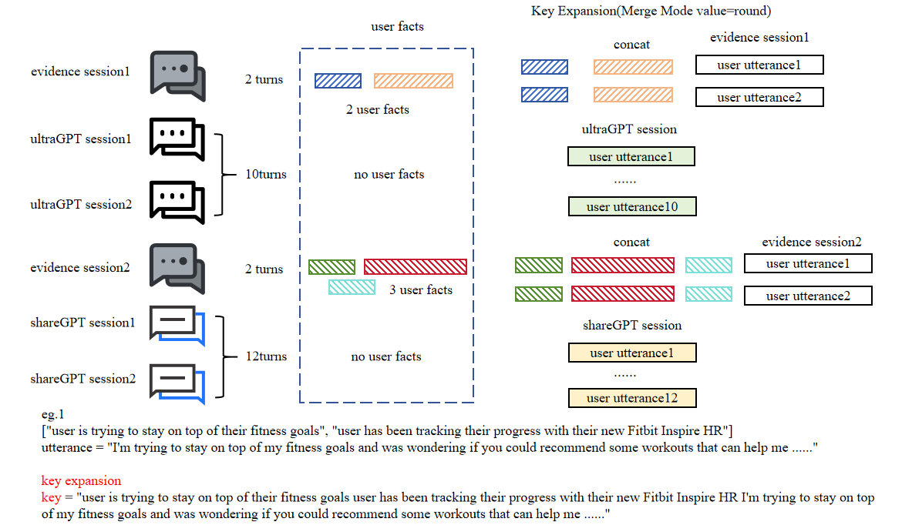

<center>图 20: Key Expansion示意。（自绘）</center>	

​	对于所有的$evidence\text{ }session$，在$value$为round且$key=value+fact$时，将从中提取的所有的user facts与用户说的话user utterance进行拼接作为新的$key$，由于ultraGPT session与shareGPT session并不抽取user fact，因此$key$保留原样，即对应的用户说的话。有几点值得注意，如在通过提示工程抽取user facts时要注意描述的人称，最好给定几个案例让模型理解，否则直接通过Zero Shot Prompting方式抽取的user facts的描述一部分是以"The user ..."开头，一部分是"I ...."开头，如果$evidence\text{ }session$对话轮数较多，从中抽取的facts数量也较大，那么key expansion后得到的$key$的内容也会较多。论文作者是先构建的$evidence\text{ }session$再组合其他的session得到最终的history，如果是反过来，有用户大量的真实场景下的对话历史记录，那么如何定位对话历史中的$evidence\text{ }session$​与抽取对话历史中的user facts需要更进一步的探索。

## 2.6  现有记忆系统总结


<center>*图 20: 现有记忆系统模式。*</center>

​	LONGMEMEVAL列举了现有的研究中的记忆系统并标明了不同索引构建细节。HippoRAG构建了一个以实体为中心的索引，而RAPTOR与Memwalker则通过递归摘要构建了一个分层索引。虽然更复杂的记忆索引结构可能对某些类型的查询有益，但它们也增加了在线交互中创建和维护索引的成本。具体来说，Flat类型Retrieval在需要添加新的记忆时，可以利用向量检索工具如Faiss/Milvus等，只需直接写入对应记忆的语义向量即可。而对于**HippoRAG**、**RAPTOR**和**Memwalker**而言，当新会话添加到记忆中时，需要对这些系统进行一定程度的重新索引，从而增加了计算开销。像ChatGPT类似的闭源商用智能聊天助手的在长期记忆方面的实现机制细节暂且未知，其官网提供了一篇推文[[19]](https://openai.com/index/memory-and-new-controls-for-chatgpt/)可让用户对其记忆管理有一定的了解，在管理界面的个性化中可以点击管理按钮查看并编辑用户的聊天记忆，可以从下图看到ChatGPT存储的记忆以facts的形式存在，笔者通过询问包含时间方面的信息验证了一下其是否有时间感知的能力。


<center>*图 21:ChatGPT记忆系统。（自绘）*</center>	

​	从聊天记录中可以看到，模型根据记忆中的facts回答十一月份和用户聊了哪些话题，但实际上用户在十一月份聊的话题与上述的facts无关，上图的facts其实是用户十二月聊的内容中提炼出来的，因此ChatGPT的记忆目前是无法感知时间的。综上，现有的关于记忆系统的研究仍未有一个成熟的解决方案。

## 2.7 打造更好的AI助手

​	**“懂我”**的终极形态是双向奔赴，即AI智能助手也能反过来主动向用户聊天，了解关心用户，这种模式超越了单向的命令和执行模式。AI不仅仅是一个响应者，它还应该能主动参与对话，甚至在适当时候引导参与者，通过主动开启对话，AI能够展现出对用户真诚的兴趣，这种主动性能够激发用户的参与感和新鲜感，从而保持用户对AI的长期兴趣。例如，如果AI知道用户在每周末喜欢阅读或进行户外活动，它可以在周末时主动提出相关的讨论话题或建议[[9]](https://mp.weixin.qq.com/s/zcSMerSKX30P2Hrwhoh0TA)。

​	站在技术角度，结合上述提到的论文或相关工作，笔者整合了一个长期记忆机制：```如下只是笔者构想```

### 2.7.1 长期记忆机制设计

​	首先是记忆存储，与Generative Agents种提到的不同层次的长期记忆类似，我们也可以设计不同层次的记忆，和Generative Agents不同，其记忆层次分为Memory Stream,Reflection,Planning and ReActing，其目的是让AI学会向人类一样思考与规划并做出合理的行动，但实际上这一套流程只能当作demo运行，不能直接应用到线上快速响应用户，因为Reflection、Planning 与ReActing的过程十分缓慢，而一般的线上AI陪伴服务也不需要智能体进行反思与规划。

​	而人脑在存储记忆时是分层次的，这里我们只关注于人脑中的长期记忆，第二节开头所述人脑的长期记忆分为语义记忆和情景记忆。语义记忆存储关于世界的一般的知识，而情景记忆则存储个人经历和特定事件的记忆。同时，人脑对记忆的感知又是比较模糊的，大脑在处理和存储记忆时，会对信息进行**提炼、筛选和概括**，以便更高效地管理和利用记忆资源。人脑在存储和回忆信息时会根据**时间跨度**和**重要性**进行分层处理，长期记忆倾向于保留概括性信息，例如我们对于昨天、上周、上个月或更远的记忆，大脑逐步抹去细节，保留大致的情节或总结。如我们可能记得昨天开了个会议，但是不记得会议中每一个人说的每一句话，我们记得上周工作很忙，但是不记得上周每天都在忙的具体事项有哪些，上个月我们完成了一个公司中的重大项目，但是不记得每一周都遇到了哪些困难踩了哪些坑等细节。这种层次化和抽象化的处理有助于大脑有效地管理记忆资源。因此在不同层次的长期记忆设计上我们可以考虑分层次存储，比如第一层记忆粒度较细，就是用户每天的对话总结，第二个层次的记忆是每周的事件总结，如用户本周遇到了什么事情，心情如何。第三个层次的记忆可以是每月的事件总结，概述当月大致发生的重要事件。

#### 2.7.1.1 记忆层次

​	人脑的长期记忆有两种，分别是语义记忆和情景记忆，语义记忆存储世界的一般知识，情景记忆则是个人经历与事件的记忆，[PerLTQA[20]]()旨在探索个性化的长期记忆在问答系统中的重要性和不同记忆类型的本质，其将个人资料与社交关系视作语义记忆，事件与对话视作情景记忆，并通过记忆分类、记忆检索与记忆综合三个子任务评估LLM的记忆利用能力。下图展示了笔者构造的长期记忆结构，在每日总结、每周总结与每月总结的基础上还有情景记忆与语义记忆。


<center>*图 22: 不同层次记忆。（自绘）*</center>	

​	笔者认为PerLTQA的方式值得借鉴，在原有的三层记忆基础上加上语义记忆和情景记忆有一定必要性。在语义记忆方面，可以提取用户的兴趣爱好、职业、社交关系等信息形成一个关于用户的动态的画像，并作为system prompt中的变量传入，用户的语义记忆可以让大语言模型了解用户固有的一些特性，可以根据用户基本特性提供个性化的建议方案或是对话风格，这一点在khanmigo的个性化教学方面有充分体现，khanmigo的AI教学功能就是通过提示工程技术在system prompt中赋予用户的兴趣爱好实现个性化的教学举例功能。

​	而情景记忆则是由两方面构成，一是用户的每日对话，二是从用户对话中抽取出的user facts。受LLM上下文窗口的限制，传入LLMs的对话历史不可能无限长，此外，较长的上下文也会导致["Lost in the middle"[21]](https://arxiv.org/abs/2307.03172)现象（模型在中间部分的信息提取能力较弱，导致对位于输入中间的信息表现出明显的遗忘现象。），因此选择一个合适大小的历史对话窗口的同时，再从用户历史对话中检索出相关的对话片段放入system prompt中让LLM了解用户相关的经历实现个性化的回复是较好的方案。之所以抽取user facts是为了在检索阶段进行$key\text{ }expansion$，即索引增强，其效果在上文介绍的LONGMEMEVAL的工作中有充分体现。

​	在记忆存储/构建索引时$key$与$value$如何选择合适？这一点我们同样可以借鉴LONGMEMEVAL的研究，在$value=round$,$key=value+fact$与$value=session,key=value+fact$两种模式的对比中我们可以发现，检索效果是前者要明显的低于后者，而问答上效果上则是前者明显高于后者，从实际问答效果出发，我们可以选择每一轮对话作为$value$，$key$为对应的$value+fact$构建索引。而在抽取user facts的时候可能会遇到一个问题，因为我们并不是针对当天对话的每一轮都进行$key\text{ }expansion$，而是只对$evidence\text{ }session$部分进行拓展，因此还需要从较长的对话历史中确定$evidence\text{ }session$的范围，再从中抽取user facts，当对话历史较长时可能还需要分批次进行处理。如下笔者列举了构建索引的两种方案：

|        |       key        | value |                   特点                   |
| :----: | :--------------: | :---: | :--------------------------------------: |
| 方案一 | value+user facts | round | 提升检索性能，抽取user facts过程较为繁琐 |
| 方案二 |      value       | round |                   简单                   |

​	在实际场景中，每几轮对话就有可能蕴含较有价值的$userfacts$，以一天的聊天记录为例，我们可以将对话分轮次拆开先后进行用户事实抽取，比如以每10轮聊天对话进行抽取，如下笔者给出一个具体的提示工程案例：

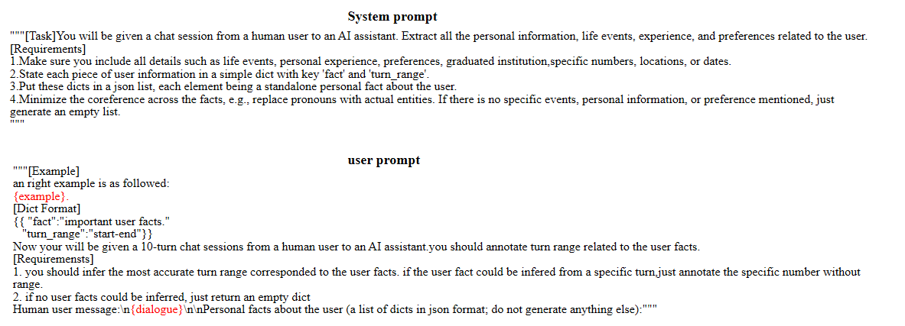

<center>*图 23: 抽取user facts提示词示例。（自绘）*</center>		

​	即每10轮对话以变量的形式传入，由大语言模型抽取出对话中有价值的用户事实，并附带对应的轮次定位。将多轮对话传入是因为在一些情况下，有价值的用户事实可能需要经过多轮对话内容才能推理出来，更多的上下文有助于模型更精准地判断有价值的用户事实，而附带上用户事实的对应轮次信息则能用于定位与后继分析，下图为一个对应的例子和模型抽取结果：

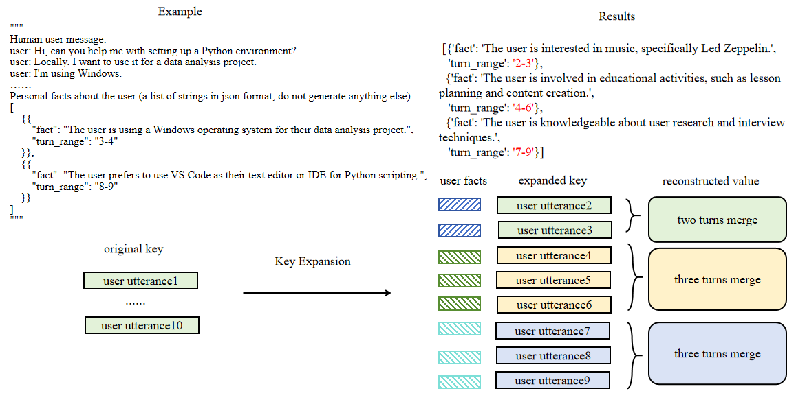

<center>*图 24: key Expansion与Value Reconstruction重构示意。（自绘）*</center>		

​	可以看到，图中左侧的例子告诉大语言模型的输出要以字典的形式输出，而右边的抽取结果也表明模型成功判断了用户事实及对应的对话轮数。此外，有一点注意，原论文中实验结果表明$value=session$时问答任务上的效果要优于$value=round$时的效果，这可能是因为$value=round$时将信息切分得过细而丢失了关键片段，而在检索任务上则是后者的模式要优于前者，因此，我们可以考虑一个混合的方法，即$value=merged\text{ }round$,$key=round$，具体如下：在存储$value$时，我们依据抽取的用户事实对应的$turn\_range$将连续的几轮对话合并作为$value$，如上图24右侧的结果中，第$7-9$连续的三轮对话合并作为一个新的$value$，这样可以包含更多的信息，提升模型问答效果。

​	在长期记忆存储方面，我们可以先选择MongoDB数据库存储半结构化的对话数据。每日对话数据我们可以创建一个collection叫做$Daily\text{ }conversation$存储每一轮的用户和助手对话。而每日对话总结、每周对话总结与每月对话总结可以再分别建立三个collection专门存储，可以通过后台定时任务如celery完成总结任务，如每天凌晨一点进行对话总结，每周一凌晨一点进行每周对话总结，每月1号凌晨一点进行上个月的每月对话总结，最后写入数据时附带上对应的时间戳信息即可。同时采用一个预训练的编码器将文本数据转化成语义向量写入对应的向量数据库如Milvus或者Faiss方便后继向量检索。

#### 2.7.1.2 记忆检索

​	记忆检索是为了从过往的情景记忆中检索出相关片段，在检索时可以考量语义相关性，时效性、事件本身重要性或其他信息，从而更精确地检索到与当前查询最相关的记忆片段，帮助智能体更准确地理解用户过往经历。可以先通过语义召回的方式检索出$k$个相关的情景记忆，再通过重排序机制从$k$个情景记忆中选取$m(m<k)$个最终的记忆。在Generative AI[11]、Hou[15]、Du[20]等人的研究中均提供了较为合理与新颖的记忆检索方法，笔者认为上述的方案其实已经能应付大多数场景了，但是抱着杠精的思想，其实不难发现，在GenerativeAI与Hou的工作中，前者的赋分方式为简单的加权平均，若超参数$\alpha,\beta,\gamma$设置任意一个不合理就可能会造成较大影响，如$\alpha$过大且时间过近时有可能导致召回出较多不相关片段，若$\beta$过大则会只召回语义类似的片段可能丢失潜在的重要信息，$\gamma$​过大则导致召回一些明面上很重要但与当前查询无关的片段。Hou的工作中没有考虑到事件的重要程度，Du的工作在对召回的记忆片段计算记忆所属类别概率时额外要求较大的计算资源。

​	**记忆选择**人脑在回忆某件事情时检索的**语义记忆**和**情景记忆**的数量没有固定的上限或具体数值，而是受到多种认知和生理因素的影响，**认知科学研究**显示，人类短期内可以同时激活大约**5到9个概念**（即米勒的“7±2法则”），但大脑在长时间内可以动态地检索和切换更多的语义记忆节点。对情景记忆而言，在一次回忆中，人们通常能详细回忆大约**4到7个关键细节**，之后逐步唤起额外的细节。但大脑往往会聚焦于**几个关键片段**，并动态地选择要检索的细节[[22]](https://chatgpt.com/share/6762650a-b728-8004-a16b-1b849c2f6985)。笔者认为可以将动态规划中的经典的01背包问题用于记忆的筛选，具体细节如下：

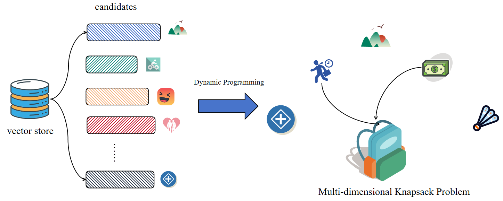

<center>*图 23: 记忆选择与背包问题。（自绘）*</center>		

​	从最简单的场景考虑，每一条记忆只有语义相似度$s_i$和时间$l_i$两条属性，假设每个用户有一个容量有限的记忆槽，能放入的记忆有限，我们要找出如何让记忆槽的利用价值最大。可以很容易联想到最大价值背包问题，假设背包能装的物品最大重量为$W$，记忆的重量是$s_i$，价值是$l_i$，那么问题变成如何选择记忆使得装入背包的记忆价值最大，这是一个经典的01背包问题。即给定$N$个物品，每个物品有重量$weight[i]$和价值$value[i]$（对应时间$l_i$和语义相似度$s_i$），给定一个容量为$W$的背包，如何从所有物品中选择若干个物品使得放入背包的物品总价值最大且不超过背包容量$W$。

​	定义一个二维数组$dp$，$dp[i][j]$表示从前$i$个物品中选择，且背包容量限制为$j$的情况下的最大价值。解决动态规划问题的最重要一步就是明确状态转移方程（递推式），是否选择第$i$个物品分析如下：（1）不选择，说明当前背包的最大价值和只考虑前$i-1$个时相同，故此时$dp[i][j]=dp[i-1][j]$，（2）选择，说明当前背包的容量是能将物品$i$放下的，容量限制为$j$时背包的剩余容量是$j-weight[i]$，加上当前物品价值$value[i]$，有$dp[i][j]=dp[i-1][j-weight[i]]+value[i]$，综合考虑有如下递推式：
$$
\begin{aligned}dp[i][j] = \max(dp[i-1][j],dp[i-1][j-weight[i]]+value[i]) \end{aligned} \tag{15}
$$
​	上述是一个经典的01背包问题，我们可以拓展到每一个记忆有语义相似度$s_i$、时间$l_i$、记忆重要程度$m_i$三个属性，这样问题变成了一个二维背包问题，二维背包问题是：每个物品$i$有两个约束条件，比如重量$weight[i]$与体积$volume[i]$（对应时间$l_i$和事件重要程度$m_i$，时间越久远则$l_i$越大，事件越不重要则$m_i$越大），背包的限制为最大重量$W$与最大体积$V$，从所有物品中选择若干个物品使得放入背包的物品总价值最大且不超过背包容量$W$与体积$V$。

​	我们可以定义一个三维的动态规划数组$dp[i][j][k]$表示从前$i$个物品中选择，且重量限制为$j$，体积限制为$k$的情况下的最大价值，同样，对于第$i$个物品我们分析如下：（1）不选择，说明当前背包最大价值和只考虑前$i-1$个时相同，$dp[i][j][k]=dp[i-1][j][k]$，（2）选择，如果$j>=weight[i]$且$k>=volume[i]$，则有$dp[i][j][k]=dp[i-1][j-weight[i]][k-volume[i]]+value[i]$，综合考虑则有如下递推式：
$$
\begin{aligned}dp[i][j][k] = \max(dp[i-1][j][k],dp[i-1][j-weight[i]][k-volume[i]]+value[i]) \end{aligned}\tag{16}
$$
​	上述情况还可以继续扩展，而随着维度的增加，时间复杂度会显著上升。关于如何根据检索出的记忆得到对应的物品重量$weight[i]$和体积$volume[i]$，则可以构造函数得出，以最近性$l_i$为例（$l_i$是自变量，$weight[i]$是因变量），时间越近则$weight[i]$越小，反之越大，此外有界和单调递增是函数必须满足的性质，我们可以很容易联想到函数$\operatorname{sigmoid}(x)=\frac{1}{1+\exp(-x)}$满足这样的性质，同理，事件的重要程度到$volume[i]$我们可以用函数$\operatorname{sigmoid}(-m_i)$​进行映射，如上便是一个简易的记忆选择方案。

### 2.7.2 离线规划

​	规划的目的是为了实现与智能助手的“双向奔赴”，这一步可以采用离线方案，目的是为了实现与用户的双向互动，比如为了让AI展示出主动性，可以通过提示工程让大语言模型根据用户和智能体当天不同层次的记忆提出三个不同的问题，并设定一个时间让智能体在第二天主动发出关于这个问题的请求等。而与先前的记忆存储与记忆检索相比，离线规划场景更为聚焦，即长期记忆系统可以无缝迁移，但是如何离线规划则取决于垂直领域场景。

#### 2.7.2.1 目标是什么？

​	关于离线规划什么？必须先明确目标，如在心理疏导场景下让智能助手主动发起话题，让用户感受到智能助手能主动地关心，建立更加稳固的关系，或是更精准地疏导用户。

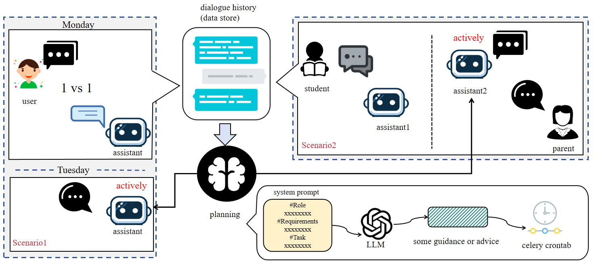

<center>*图 24: 这是图片的图例描述。（自绘）*</center>		

​	**场景一：**用户找智能助手进行心理疏导，为了实现主动式对话，可以为用户的每一轮回复进行情绪分析，对用户负面情绪等级从$0-10$进行打分，若用户连续$M$轮内的负面情绪总分相加超过预先定义的阈值，则可以触发主动式聊天机制。此外，也可以依据用户和智能助手的每日聊天总结，离线规划出一个大纲，再反过来指导智能助手第二天要主动和用户发起合适的话题。

​	**场景二：**一个孩子端与家长端的对话场景，孩子与智能助手1聊天（智能助手1身份是一个语言温暖，共情能力十足的朋友），家长与智能助手2（智能助手2身份是一位有多年教育经验、精通心理学的老师）聊天。孩子和家长再日常生活中总是会遇到矛盾的，尤其是青春期，这个时期的孩子大多充满叛逆、情绪波动较大，不易理解家长良苦用心，而家长往往感到困惑和无力，不知道如何与孩子有效沟通。场景二下的的$planning$功能则为家长与孩子的沟通建立起一座隐式的桥梁，如孩子和智能助手1吐槽父母对自己太苛刻，$planning$模块根据每天孩子与智能助手1的聊天了解到孩子与父母的相处现状，为此指定了一套详细的方案并告知智能助手2并由其转告父母。

## 2.8 本章小结

​	本章节梳理了个性化智能助手的长期记忆系统，从最开始的Memory Bank到最后的LongMemEval的研究都一定程度聚焦于如何更好地检索到和用户查询跟相关的记忆片段，例如，在检索阶段，计算记忆相似度时附加上时间近效性，或是考虑到事件的重要程度以提高检索质量，此外，HippoRAG借鉴了人脑长期记忆系统，采用不同的索引设计模式，使其能更好的解决多跳推理的问题。这些研究为设计个性化智能助手长期记忆机制提供了宝贵的参考价值，然而，仅仅优化记忆的检索能力并不足以打造真正“懂我”的智能助手。智能助手还需具备更深入的用户理解能力，如感知用户情绪、了解个性化喜好，并能够主动发起对话。只有当助手展现出更“拟人化”的交互特性，才能与用户建立更持久的互动与情感连接。

​	让智能助手和用户实现”双向奔赴“不单是一个技术性的问题，同时还依赖于应用场景和产品定位。如在教育场景和心理场景下，用户对智能助手的需求是不一样的，前者的用户群体可能更希望得到精准的知识追踪能力，智能助手根据用户习题反馈了解到用户在某些知识点方面掌握不全，从而进行跟个性化的学习资源推荐或者学习路径规划，后者的用户群体可能希望得到更共情的心理疏导与引导，这种能力依赖于大语言模型的规划能力，比如大语言模型根据用户画像和对话上下文进行思考，先总结出用户可能面临的问题，再进行任务拆解，并执行。智能助手在与用户的长期交互中，不可避免地会面临信息不足、推理错误或理解偏差的问题。反思机制使其能够在对话过程中不断调整自身的行为。例如，当智能助手发现某个建议未能有效帮助用户时，可以基于用户的反馈进行自我评估，调整对话策略，并在后续交流中提供更符合用户需求的建议。

​	此外，大语言模型的规划与博弈论密切相关，特别是在多阶段决策、动态调整策略和与其他智能体交互的场景中。博弈论为我们提供了分析和优化决策过程的工具，尤其是在不确定性和冲突的情况下。大语言模型在规划过程中，尤其是在复杂的多轮任务中，也面临着类似的决策挑战，比如如何选择最优策略、如何处理多个可能的未来情境，以及如何考虑到不同参与者的反应。未来的研究可以进一步探索在某领域下某应用场景下，如何结合强化学习、博弈论理论技术提升大语言模型的规划能力，使个性化智能助手更具智能性和可持续性。


# 参考文献

[[1]The Rise and Potential of Large Language Model Based Agents: A Survey](https://arxiv.org/pdf/2309.07864v3)

[[2]Weng, Lilian. (Jun 2023). “LLM-powered Autonomous Agents”. Lil’Log.](https://lilianweng.github.io/posts/2023-06-23-agent/.)

[[3]**Chain**-of-**thought** prompting elicits reasoning in large language models](https://proceedings.neurips.cc/paper_files/paper/2022/hash/9d5609613524ecf4f15af0f7b31abca4-Abstract-Conference.html)

[[4]**Tree** of **thoughts**: Deliberate problem solving with large language models](https://proceedings.neurips.cc/paper_files/paper/2023/hash/271db9922b8d1f4dd7aaef84ed5ac703-Abstract-Conference.html)

[[5]**Least**-to-**most** prompting enables complex reasoning in large language models](https://arxiv.org/abs/2205.10625)

[[6]ReAct: Synergizing Reasoning and Acting in Language Models](https://arxiv.org/abs/2210.03629)

[[7]Reflexion: Language agents with verbal reinforcement learning](https://proceedings.neurips.cc/paper_files/paper/2023/hash/1b44b878bb782e6954cd888628510e90-Abstract-Conference.html)

[[8]Chain of Hindsight Aligns Language Models with Feedback](https://arxiv.org/abs/2302.02676)

[[9]十问“AI陪伴”：现状、趋势与机会](https://mp.weixin.qq.com/s/zcSMerSKX30P2Hrwhoh0TA)

[[10]MemoryBank: Enhancing Large Language Models with Long-Term Memory](https://ojs.aaai.org/index.php/AAAI/article/view/29946)

[[11]Generative Agents: Interactive Simulacra of Human Behavior](https://dl.acm.org/doi/abs/10.1145/3586183.3606763)

[[12]It's About Time: Incorporating Temporality in Retrieval Augmented Language Models](https://arxiv.org/abs/2401.13222)

[[13]Human-inspired Perspectives: A Survey on AI Long-term Memory](https://arxiv.org/abs/2411.00489)

[[14] A Neurocognitive Model of Advertisement Content and Brand Name Recall.](https://pubsonline.informs.org/doi/abs/10.1287/mksc.1060.0212)

[[15]"My agent understands me better": Integrating Dynamic Human-like Memory Recall and Consolidation in LLM-Based Agents](https://dl.acm.org/doi/abs/10.1145/3613905.3650839)

[[16]HippoRAG: Neurobiologically Inspired Long-Term Memory for Large Language Models](https://arxiv.org/abs/2405.14831)

[[17]LLMs + Persona-Plug = Personalized LLMs](https://arxiv.org/abs/2409.11901)

[[18]LongMemEval: Benchmarking Chat Assistants on Long-Term Interactive Memory](https://arxiv.org/abs/2410.10813)

[[19]Memory and new controls for ChatGPT](https://openai.com/index/memory-and-new-controls-for-chatgpt/)

[[20]PerLTQA: A Personal Long-Term Memory Dataset for Memory Classification, Retrieval, and Synthesis in Question Answering]()

[[21]Lost in the Middle: How Language Models Use Long Contexts](https://arxiv.org/abs/2307.03172)

[[22]GPT聊天询问](https://chatgpt.com/share/6762650a-b728-8004-a16b-1b849c2f6985)
